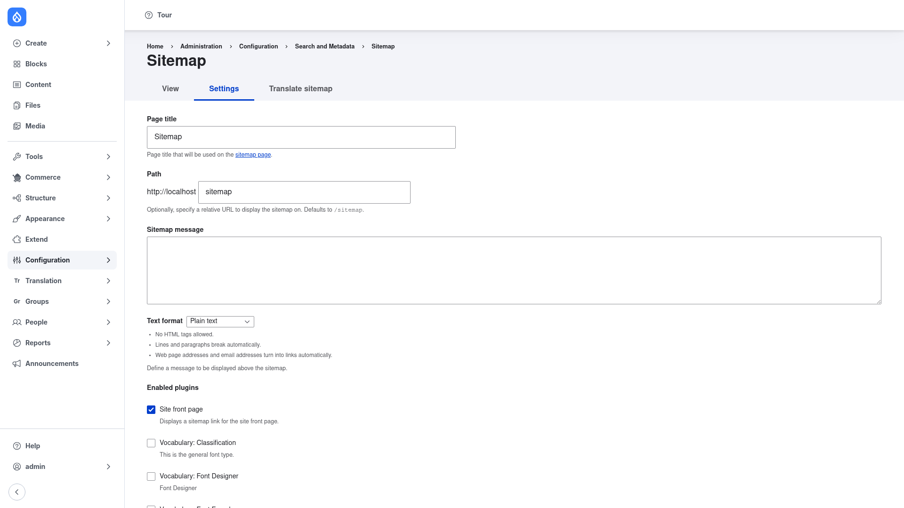

# Sitemap — manual setup guide

**Sitemap** (`sitemap`) builds a single **human-readable** overview page — by
default at `/sitemap` — that gives your visitors a bird's-eye view of how your
site is organised. On that one page you can list the site's menus, its taxonomy
vocabularies (optionally with the number of items in each term), the front page,
book outlines, and RSS feed links, all assembled from configurable sections. It
is a friendly, navigable index of your site's structure aimed at **people**.

> **This is not the XML sitemap for search engines.** Sitemap produces an HTML
> page for human visitors to read. It does **not** generate the machine-readable
> `sitemap.xml` file that search engines crawl. If you need that, install the
> separate **[Simple XML Sitemap](https://www.drupal.org/project/simple_sitemap)**
> or **[XML Sitemap](https://www.drupal.org/project/xmlsitemap)** module instead —
> they solve a completely different problem. The two kinds of module happily
> coexist: many sites run one of each.

This guide is written for a **human** clicking through the admin UI. It walks you,
step by step and with screenshots, from installing the module to configuring which
sections appear on your sitemap page. If you are looking for terse, token-cheap
references for an AI coding agent, read the sibling [`agent/`](../agent/start.md)
docs instead.

## Where it lives in the admin menu

Everything in this guide sits under **Configuration → Search and metadata →
Sitemap** (`/admin/config/search/sitemap`). That settings page is organised into
tabs:

- **View** — opens the live sitemap page.
- **Settings** — the configuration form covered in this guide (page title, path,
  intro message, and which sections to include).
- **Translate sitemap** — translate the configurable text.

The finished sitemap page itself is shown to visitors at `/sitemap` (or whatever
path you choose).

## Contents

1. [Installation](installation/index.md) — install Sitemap with Composer, enable
   it, and confirm the `/sitemap` page is reachable.
2. [Configuration](configuration/index.md) — set the page title and intro message,
   then tick which sections (front page, menus, vocabularies, books, RSS links)
   appear on the page.
