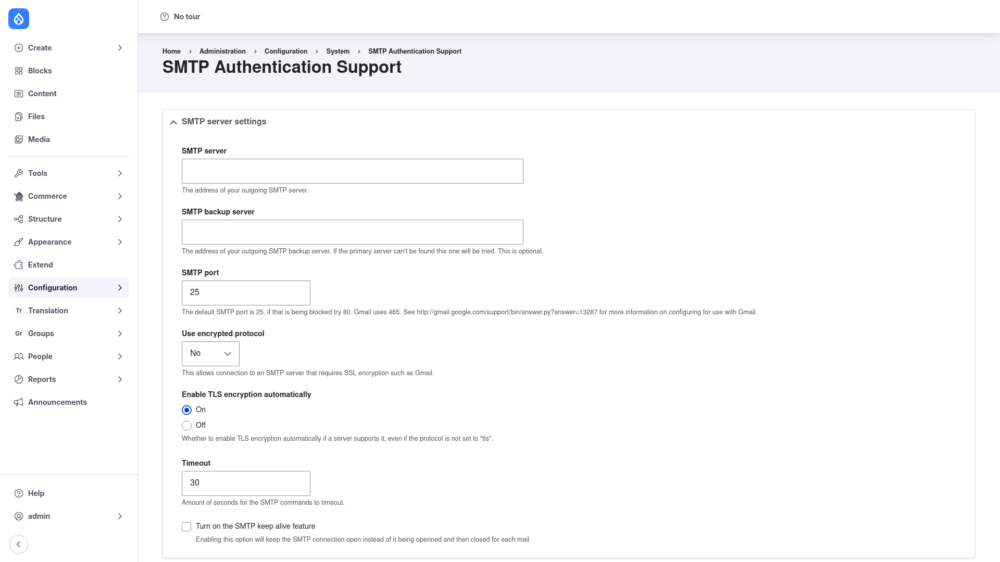

# Configuration

All of the module's settings live on a single page. This section walks through
turning SMTP on, pointing Drupal at your SMTP server, entering your login
credentials, setting the default "from" address, and sending a test email to
confirm mail is being delivered.

## Open the settings page

1. Go to **Configuration → System → SMTP Authentication Support**
   (`/admin/config/system/smtp`).

## Turn SMTP support on

At the top of the page is the master on/off toggle (**Turn this module on or
off**). While it is **Off**, Drupal keeps using its normal mail system and none
of the settings below take effect. Set it to **On** to route outgoing mail
through the SMTP server you configure below.

> Turning SMTP on swaps Drupal's default mail backend for the module's
> PHPMailer-based one and remembers the previous backend, so switching the toggle
> back to **Off** restores your site's original mail system.

Tip: you can fill in and **Save** the server details first while the toggle is
still Off, send a test email to prove the connection works, and only then flip
the toggle to On for live traffic.

## Enter the SMTP server settings

Under **SMTP server settings**, fill in the details your mail provider gives you:

- **SMTP server** — the hostname (address) of your outgoing SMTP server, for
  example `smtp.gmail.com` or `smtp.sendgrid.net`.
- **SMTP backup server** — an optional failover host. If the primary server
  can't be reached, this one is tried instead. Leave it blank if you don't have
  one.
- **SMTP port** — the port the server listens on. The default is `25`; if that is
  blocked, common alternatives are `465` (SSL) and `587` (TLS). Use the value
  your provider specifies.
- **Use encrypted protocol** — choose the encryption used for the connection.
  Leave it at **No** for an unencrypted connection, or pick **SSL** or **TLS**
  for a server that requires encryption (such as Gmail). Match this to the port
  and provider requirements.
- **Enable TLS encryption automatically** — when **On**, the connection is
  upgraded to TLS opportunistically if the server supports it, even when the
  protocol above is not set to TLS. This is on by default and is safe to leave
  on.
- **Timeout** — how many seconds to wait for SMTP commands before giving up. The
  default is `30`. Lowering it makes the site fail fast against a dead host.
- **Turn on the SMTP keep alive feature** — when ticked, the SMTP connection is
  kept open across multiple messages instead of being opened and closed for each
  one. Leave it unticked unless you are sending mail in bulk.

## Enter your SMTP authentication

Further down the page, in the SMTP authentication section, enter the credentials
your provider issued:

- **Username** — the username (often the full email address, or an API-key name
  such as `apikey` for SendGrid) used to log in to the SMTP server.
- **Password** — the matching password or API key.

!!! warning "Handle the password securely"
    As covered in [Installation](../installation/index.md), avoid committing this
    password anywhere. Keep it in an environment variable and treat any exported
    Drupal configuration that contains it as a secret — do not check it into your
    repository.

## Set the default "from" address and name

In the email options section, set the identity your site's mail is sent as:

- **E-mail from address** — the address outgoing site mail should appear to come
  from (for example `no-reply@example.com`). Many providers require this to be an
  address you are authorised to send from.
- **E-mail from name** — the display name shown alongside that address (for
  example your site's name).

## Send a test email to verify

Before relying on the configuration, use the built-in test tool near the bottom
of the page:

1. In the **Send test e-mail** field, enter an address you can check (your own
   inbox).
2. Click **Save configuration**. The module saves your settings and sends a test
   message to that address using them.
3. Check the inbox. If the test email arrives, your server, credentials, and
   "from" address are all working. If it does not, re-check the host, port,
   encryption protocol, username, and password.

## Save

Click **Save configuration** at the bottom to store everything. With the master
toggle set to **On**, all of your site's outgoing email — user registration and
password-reset messages, contact-form and Webform notifications, and so on — now
goes out through your SMTP server.
