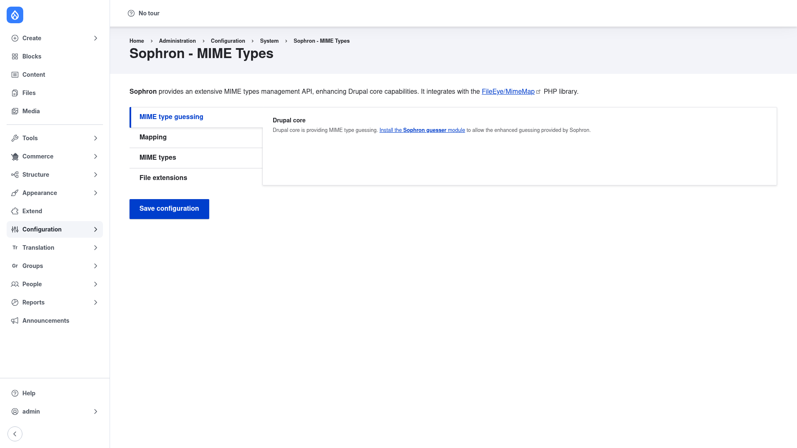

# Installation

## Requirements

Sophron needs **Drupal 11.2+ (or 12)** and one external PHP library, which Composer
pulls in automatically:

- **FileEye/MimeMap** (`fileeye/mimemap`, `^2.2.5`) — the standards-based MIME-type
  library that Sophron wraps. This is a Composer dependency, not a Drupal module, so
  you must install Sophron **with Composer** rather than by unzipping it, otherwise
  the library will be missing and the module will not work.

Sophron has no other contrib-module dependencies. It ships one optional submodule:

- **Sophron guesser** (`sophron_guesser`) — replaces Drupal core's extension-based
  MIME-type guesser with Sophron's. Enable this if you want the richer mapping to
  apply site-wide to uploads and file handling, not just to code that calls the
  `MimeMapManager` service directly. The MIME type guessing tab on the settings page
  reminds you to install it and shows whether core or Sophron is currently active.

## Install with Composer

From the project root:

```bash
composer require drupal/sophron -W
```

The `-W` (`--with-all-dependencies`) flag lets Composer pull in and update the
`fileeye/mimemap` library and any shared dependencies as needed.

> **Using DDEV?** Prefix Composer and Drush with `ddev` when you run from your host
> machine — `ddev composer require drupal/sophron -W`, `ddev drush …`. Inside the
> container (`ddev ssh`) run them without the prefix.

## Enable the module

```bash
drush en sophron -y
```

To also replace core's MIME guesser site-wide, enable the submodule as well:

```bash
drush en sophron_guesser -y
```

## Verify it worked

Log in as an administrator and go to **Configuration → System → Sophron**
(`/admin/config/system/sophron`). You should see the **Sophron – MIME Types** page
with its four tabs — **MIME type guessing**, **Mapping**, **MIME types**, and
**File extensions** — and a **Save configuration** button:



If the page loads and those tabs are present, the module (and the FileEye/MimeMap
library behind it) is installed correctly. Next, review the
[configuration](../configuration/index.md) to choose a map class and, if needed, add
map commands.
