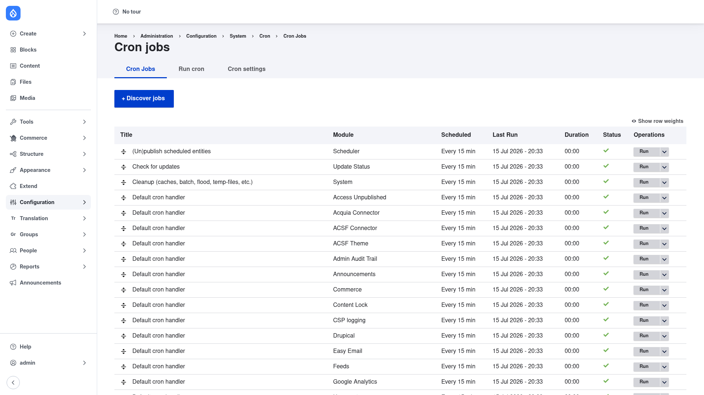

# Configuration — running and scheduling jobs

Ultimate Cron's day-to-day work happens on the **Cron jobs** list. Every cron
task on your site appears here as its own row, and from that row you can run a
job on demand, give it its own schedule, choose how it runs and how it logs,
turn it on or off, and review its history. This page walks through each of those
tasks.

## Open the Cron jobs list

1. Go to **Configuration → System → Cron → Jobs**
   (`/admin/config/system/cron/jobs`).
2. The **Cron Jobs** tab is selected by default.

### Reading the list

Each row is one cron job. The columns are:

- **Title** — the job's human-readable name (for example *Cleanup (caches, batch,
  flood, temp-files, etc.)*). The small up/down handle on the left lets you drag
  rows to reorder them; click **Show row weights** (top right) to set the order
  with numeric weights instead.
- **Module** — which module the job belongs to. Because jobs are auto-discovered
  from each module's `hook_cron()`, you will usually see one *Default cron
  handler* row per module, plus named jobs from modules that declare their own.
- **Scheduled** — how often the job is currently set to run (for example *Every 15
  min*). This is what the job's scheduler has decided.
- **Last Run** — the date and time the job last executed.
- **Duration** — how long the last run took.
- **Status** — a check mark for a healthy job.
- **Operations** — the **Run** button plus a dropdown of the other actions (edit,
  enable/disable, view logs), covered below.

The **+ Discover jobs** button at the top re-scans your modules for any new cron
jobs — useful after you install a module that adds one.

## Run a job manually

You do not have to wait for the next cron run — you can execute a single job on
demand:

1. Find the job's row.
2. Click the **Run** button in its **Operations** column.

Only that one job runs; the rest of cron is left alone. When it finishes, its
**Last Run** and **Duration** update to reflect the run you just triggered.

## Edit a job: its schedule, launcher, and logger

To change how and when a job runs, open its edit form:

1. In the job's **Operations** column, open the dropdown next to **Run** and
   choose **Edit**.
2. The edit form is organised into three parts — the scheduler, the launcher, and
   the logger. Each is a plugin you configure independently.

### Scheduler — when the job runs

The **scheduler** decides when a job is due. There are two choices:

- **Simple** — pick a preset interval (such as every 5, 15, or 30 minutes). This
  is the easiest option and covers most needs.
- **Crontab** — write full crontab-style **rules** for fine-grained timing. The
  syntax is crontab-like with two Ultimate Cron extensions: a `+` adds a
  catch-up/fuzz offset, and an `@` jitters the minute so that heavy jobs do not
  all fire in the same cron window. For example, `*/15+@ * * * *` means roughly
  "every 15 minutes, staggered", and `0+@ */6 * * *` means "every 6 hours".

Remember that these rules only take effect as often as your external cron trigger
fires (see [Installation](../installation/index.md)); a rule of "every 5 minutes"
needs cron to be triggered at least that often.

### Launcher — how the job runs

The **launcher** controls execution. By default jobs run **serially** (one after
another). Its key settings are:

- **Lock timeout** — how many seconds before a job's lock is treated as stale
  (default `3600`). This protects against a crashed run leaving a job locked
  forever.
- **Maximum execution time** — the longest a job may run before it is cut off
  (default `3600` seconds), to cap runaway tasks.
- **Thread / pool limits** — how many copies of a job may run at once (default
  `1`). Raising this lets suitable jobs run in parallel rather than blocking each
  other.

### Logger — how runs are recorded

The **logger** records each execution. There are two options:

- **Database** — stores a full history in the database, with retention controls:
  keep the last *N* log rows per job (default `1000`) and/or expire logs after a
  number of seconds (default `1209600`, i.e. 14 days).
- **Cache** — a lightweight, cache-based logger, better suited to high-frequency
  jobs where you do not want to accumulate database rows.

When you are done, **save** the form. The job's new schedule shows up in the
**Scheduled** column back on the list.

## Enable or disable a job

If a job is noisy, broken, or simply not needed, you can switch it off without
touching the others:

1. In the job's **Operations** dropdown, choose **Disable**.
2. The job stops being scheduled and run, while every other job keeps working.

To turn it back on, open the same dropdown and choose **Enable**.

## View a job's logs

Each job keeps its own execution history:

1. In the job's **Operations** dropdown, choose **Logs** (the per-job logs page,
   `/admin/config/system/cron/jobs/logs/{job}`).
2. The log lists past runs with the **duration**, **status/severity**, and any
   messages recorded during the run. This is the first place to look when a task
   is not doing what you expect — you can see whether it ran, how long it took,
   and whether it reported an error.
