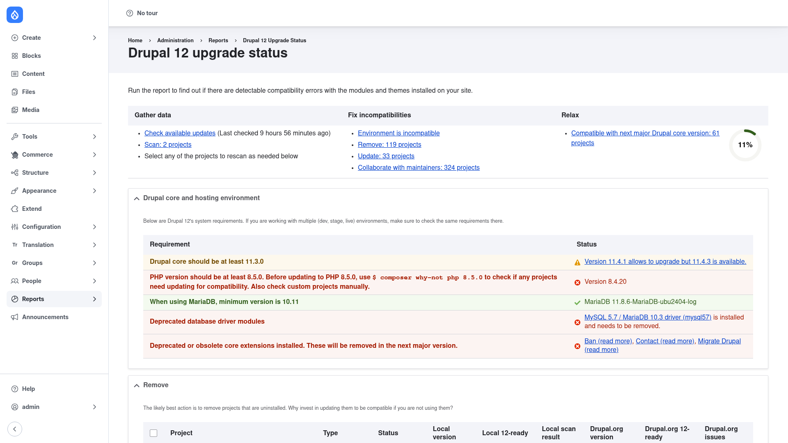

# Installation

## Requirements

Upgrade Status runs on **Drupal 9, 10, or 11** (`^9 || ^10 || ^11`). It depends on:

- Core's **Update** module (`update`), which it enables automatically — this is how
  it learns which contrib projects have a compatible release available.
- A **PHPStan toolchain** that Composer installs alongside it: `mglaman/phpstan-drupal`,
  `phpstan/phpstan-deprecation-rules`, `nikic/php-parser`, `dekor/php-array-table`,
  `webflo/drupal-finder`, and `symfony/process`. These do the actual static analysis
  of your code — you do not install them by hand; `composer require` pulls them in.

Because it analyses source files on disk, Upgrade Status works best on a **full code
checkout** (a normal Composer-managed site or git checkout) where the module and theme
files it scans are actually present — not a stripped-down artifact.

## Install with Composer

Upgrade Status is a **development tool**, so require it with `--dev` so it lands in
`require-dev` and stays out of your production build. From the project root:

```bash
composer require drupal/upgrade_status -W --dev
```

The `-W` (`--with-all-dependencies`) flag lets Composer pull in and update the
PHPStan toolchain it needs.

> **Using DDEV?** Prefix Composer and Drush with `ddev` when you run from your host
> machine — `ddev composer require drupal/upgrade_status -W --dev`, `ddev drush …`.
> Inside the container (`ddev ssh`) run them without the prefix.

## Enable the module

```bash
drush en upgrade_status -y
```

This also enables core's **Update** module as a dependency. Once enabled, the report
appears under **Reports → Upgrade status** (`/admin/reports/upgrade-status`).

## Verify it worked

Log in as an administrator (you need the **administer software updates** permission)
and go to `/admin/reports/upgrade-status`. You should see the **Upgrade status**
report, with the environment section and a project list:



If the page loads with the *Drupal core and hosting environment* section and a list
of projects, the module is installed correctly. Next, head to
[Running a scan](../running-a-scan/index.md).

Prefer the command line? Upgrade Status also ships a Drush command,
`drush upgrade_status:analyze`, so you can run the whole analysis without the UI —
handy for CI. See [Running a scan](../running-a-scan/index.md) for details.
