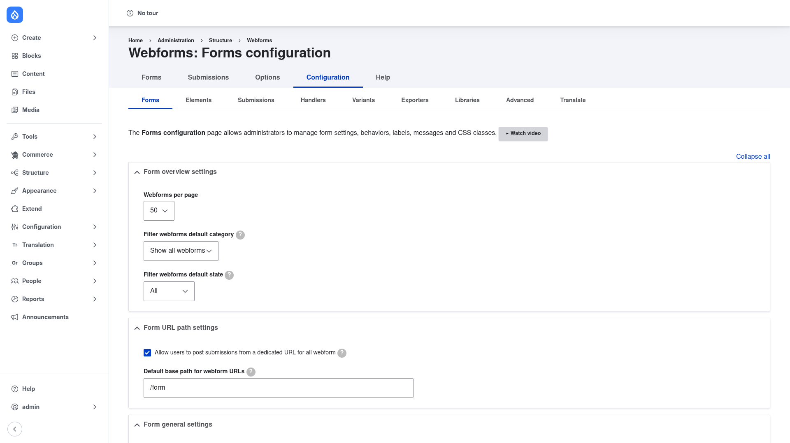

# Configuration — global Webforms settings

Individual forms carry their own settings, but Webform also has a **site-wide
configuration** area that sets the defaults and behaviour for *every* form on the
site — how the forms list looks, the default URL forms are served from, global labels
and messages, which elements and handlers are available, how submissions are stored,
and more.

You rarely need to touch this to get a first form working, but it is worth knowing
where it lives.

## Open the configuration page

1. Go to **Structure → Webforms** (`/admin/structure/webform`).
2. Click the **Configuration** tab in the row of tabs across the top
   (Forms / Submissions / Options / Configuration / Help).

You land on **Webforms: Forms configuration** (`/admin/structure/webform/config`):

## The configuration tabs

The configuration area is split into a second row of sub-tabs, each covering one
slice of Webform's global behaviour:

- **Forms** — the page shown above: how forms and the forms list behave.
- **Elements** — default element settings and which element types are allowed.
- **Submissions** — how submission data is stored, purged, and displayed.
- **Handlers** — defaults for the actions that run on submit (email, remote post).
- **Variants** — settings for A/B-style form variants.
- **Exporters** — defaults for exporting submissions (CSV, JSON, and so on).
- **Libraries** — enable or disable the third-party JavaScript/CSS libraries Webform
  can use.
- **Advanced** — miscellaneous global options.
- **Translate** — translate the built-in Webform interface strings.

## The Forms tab

The **Forms** sub-tab (open by default) groups its options into collapsible sections.
The two shown above:

### Form overview settings

Controls the forms list you saw during installation:

- **Webforms per page** — how many forms are listed per page before pagination kicks
  in (default **50**).
- **Filter webforms default category** — which category the list is filtered to when
  you first open it (default **Show all webforms**).
- **Filter webforms default state** — whether the list defaults to showing all forms
  or only open/closed ones (default **All**).

### Form URL path settings

Controls the addresses your forms are served from:

- **Allow users to post submissions from a dedicated URL for all webform** — when
  ticked (the default), each form gets its own front-end page.
- **Default base path for webform URLs** — the URL prefix every form page lives under
  (default **/form**), so a form with the machine name `contact` is reached at
  `/form/contact`.

Scroll further down the Forms tab for additional sections (general settings, default
confirmation and validation messages, CSS classes, and more). Change what you need,
then click **Save configuration** at the bottom.

Next: [create your first webform](../creating-a-webform/index.md).
