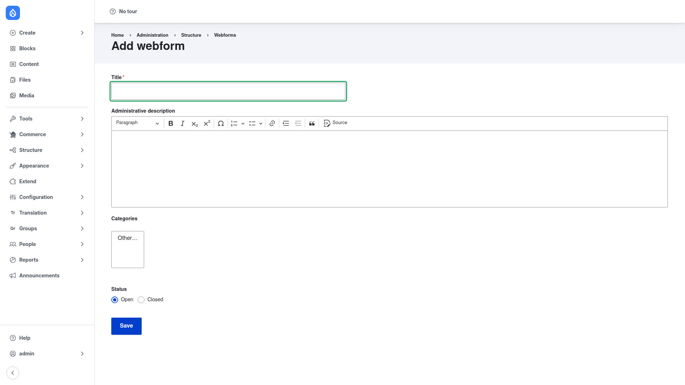

# Creating a webform

Building a form with Webform is a three-part flow: **create** the form (give it a
title), **build** it up by adding elements, and then **collect and review** the
submissions people send in. This page walks through each step.

> The drag-and-drop element builder used below comes from the **Webform UI**
> submodule. If you have not enabled it yet, run `drush en webform_ui -y` first (see
> [Installation](../installation/index.md)).

## 1. Open the Webforms list

Go to **Structure → Webforms** (`/admin/structure/webform`). This is the **Forms**
management page — every form on the site is listed here, with its description,
category, open/closed status, and a **Results** count linking to its submissions.
Click the blue **+ Add webform** button at the top:

## 2. Give the form a title

You are taken to the **Add webform** form (`/admin/structure/webform/add`):

Fill it in:

1. **Title** *(required)* — the human-readable name of your form, e.g. *Contact us*.
   Drupal derives the machine name (the id used in URLs) from this automatically.
2. **Administrative description** — an optional note, shown only to administrators in
   the forms list, describing what the form is for. It uses a rich-text editor.
3. **Categories** — an optional grouping used to filter the forms list. Leave it at
   *Other…* if you have no categories set up.
4. **Status** — **Open** (the default) means the form accepts submissions right away;
   **Closed** hides the form from visitors until you reopen it.

Click **Save**. Webform creates the form and drops you straight into its **Build**
tab, ready for elements.

## 3. Build the form by adding elements

The **Build** tab is where a form takes shape. It starts empty. To add fields:

1. Click **+ Add element**. A dialog lists the full element library, grouped by type
   — basic inputs (text field, email, telephone, textarea), options elements
   (checkboxes, radios, select), dates and times, file uploads, composite elements
   (name, address), and layout/advanced elements (wizard pages, sections, computed
   values).
2. Pick an element type. Its configuration form opens: give it a **Title**, decide
   whether it is **Required**, set default values, help text, and — under
   **Conditions** — any show/hide logic that depends on other fields.
3. Click **Save** to add the element to the form. Repeat for every field you need.
4. Back on the Build tab, **drag the rows** by their handles to reorder elements or
   nest them inside containers and wizard pages.

Two power-user options live alongside the visual builder:

- The **Source (YAML)** tab lets you edit the whole element tree directly as YAML —
  faster once you know the syntax, and the format forms are exported in.
- The **Settings** tab controls form-level behaviour: open/close dates, submission
  limits, the confirmation message or redirect shown after submitting, draft saving,
  and multi-step wizard behaviour.

Use **View** at any time to see the live form exactly as a visitor will, and submit a
test entry.

## 4. Collect and review submissions

Every time someone submits the form, Webform saves a **submission**. To review them:

1. From the Webforms list, click the number in the **Results** column for your form
   (or open the form and choose the **Results** tab).
2. **Results → Submissions** lists every response in a table. Click any row to view
   the full submission, and use the row operations to edit or delete it.
3. **Results → Download** exports the submissions to CSV, TSV, JSON, or YAML for
   analysis in a spreadsheet or another system.

To have the form *do* something on submit — email a notification, send an
autoresponder to the person who filled it in, or POST the data to an external API —
add a **handler** under the form's **Settings → Emails / Handlers** tab. Handlers are
covered in the agent-facing [`handlers`](../../agent/configure/handlers.md) reference.
