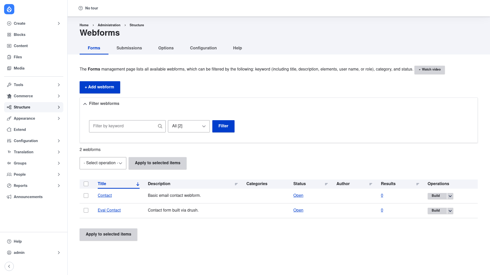

# Installation

## Requirements

Webform runs on **Drupal 10.3+ or 11** and relies only on three modules that ship
with Drupal core, so there are no extra contrib dependencies to install:

- **Field** (`field`)
- **Filter** (`filter`)
- **User** (`user`)

These are enabled on a standard Drupal install already, so in practice Webform
installs cleanly on its own.

## Install with Composer

From the project root:

```bash
composer require drupal/webform -W
```

The `-W` (`--with-all-dependencies`) flag lets Composer update any shared
dependencies as needed.

> **Using DDEV?** Prefix Composer and Drush with `ddev` when you run from your host
> machine — `ddev composer require drupal/webform -W`, `ddev drush …`. Inside the
> container (`ddev ssh`) run them without the prefix.

## Enable the module

```bash
drush en webform -y
```

Once enabled, the form-management screens appear under **Structure → Webforms**
(`/admin/structure/webform`).

## Submodules — enable only what you need

Webform ships a large set of optional submodules; enable them individually with
`drush en <name> -y`. The most commonly wanted ones:

| Submodule | Machine name | What it adds |
|-----------|--------------|--------------|
| **Webform UI** | `webform_ui` | The drag-and-drop element builder — lets you add and arrange form elements through forms instead of editing raw YAML. Enable this first; the [Creating a webform](../creating-a-webform/index.md) guide uses it. |
| **Webform Node** | `webform_node` | A "Webform" content type so you can embed a form inside page content as a node. |
| **Webform Templates** | `webform_templates` | Reusable starter forms you can copy to spin up new webforms quickly. |
| **Webform Submission Log** | `webform_submission_log` | Logs every submission event for auditing. |
| **Webform Options Limit** | `webform_options_limit` | Per-option submission limits — handy for event registrations. |
| **Webform Scheduled Email** | `webform_scheduled_email` | Sends reminder or follow-up emails on a schedule after submission. |

For example, to enable the build UI:

```bash
drush en webform_ui -y
```

## Verify it worked

Log in as an administrator and go to `/admin/structure/webform`. You should land on
the **Webforms** management page — the **Forms** tab listing every form on the site,
with an **+ Add webform** button at the top:



If the page loads, the module is installed correctly. Next, review the
[global configuration](../configuration/index.md) or jump straight to
[creating your first form](../creating-a-webform/index.md).
