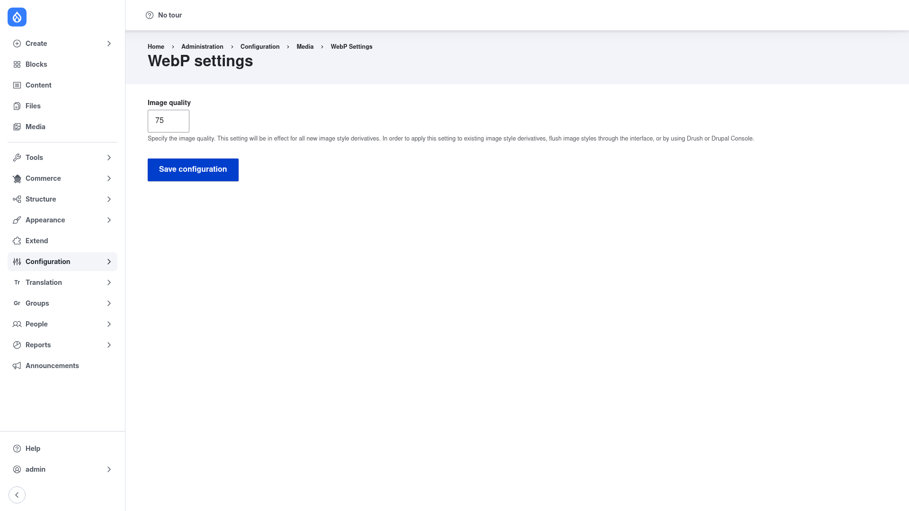

# Configuration

WebP has a single global setting: the **compression quality** used when it encodes
your `.webp` copies. This one value applies to every WebP derivative the module
generates, across all of your image styles — there is no per-image-style override in
this version.

## Open the settings page

1. Go to **Configuration → Media → WebP**
   (`/admin/config/media/webp/settings`).

## Set the WebP quality

1. In the **Image quality** field, enter a number from **0 to 100**. This is the
   classic size-versus-quality trade-off: a **lower** number produces smaller
   `.webp` files that load faster but look softer; a **higher** number keeps more
   detail at the cost of larger files. The default is **75**, which is a good
   balance for most sites.
2. Click **Save configuration**.

As the on-page help notes, this value takes effect for **all new image-style
derivatives**. To apply a changed quality to derivatives that already exist, flush
your image styles (through the admin interface, or with Drush).

## How it works

Once WebP is enabled and the quality is set, you do not have to change your image
styles or theme templates — the module works in the background:

- **A `.webp` companion for every derivative.** Whenever Drupal generates an
  image-style derivative, WebP produces a matching `.webp` copy of it at the quality
  you configured. These copies are created on demand: the first time a derivative is
  requested, the module's own download controllers generate the `.webp` file
  alongside the original.
- **WebP is served to browsers that support it.** On responsive images, WebP rewrites
  the `<picture>` element — for each existing source it adds a WebP source
  (marked `type="image/webp"`) at the top of the list, pointing at the `.webp` URL.
  Browsers that understand WebP pick that source automatically.
- **Graceful fallback everywhere else.** Browsers that do not support WebP simply
  ignore the `image/webp` source and use the original JPEG/PNG source in the same
  `<picture>` element, so every visitor still sees an image.
- **Stale copies are cleaned up.** When an entity's image changes, WebP flushes the
  outdated `.webp` derivatives so no one is served a stale copy.

The net effect: supporting browsers download noticeably lighter images with no
change to your content or templates, and everyone else keeps the original format.
