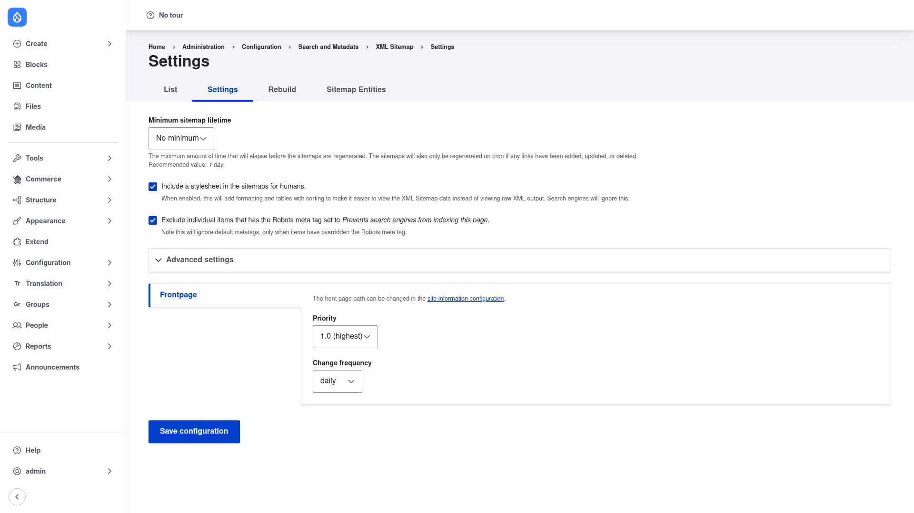

# Configuration

Configuring XML Sitemap is a two-part job: tune the **global generation settings**
(the Settings tab), then choose **what content goes into the sitemap** (the Sitemap
Entities tab) and rebuild. This page walks through both.

## Global settings

### Open the Settings tab

1. Go to **Configuration → Search and metadata → XML Sitemap**
   (`/admin/config/search/xmlsitemap`).
2. Click the **Settings** tab (`/admin/config/search/xmlsitemap/settings`).

### The fields

- **Minimum sitemap lifetime** — the minimum amount of time that must elapse before
  the sitemaps are regenerated on cron. Even after this time passes, the sitemap is
  only regenerated if links have actually been added, updated, or deleted. The
  default is **No minimum**; the recommended value is **1 day**, which stops a busy
  site from regenerating the whole sitemap on every cron run.
- **Include a stylesheet in the sitemaps for humans** — when enabled (the default),
  the module adds formatting and sortable tables so the sitemap is easy to read in a
  browser instead of showing raw XML. Search engines ignore this styling.
- **Exclude individual items that have the Robots meta tag set to *Prevents search
  engines from indexing this page*** — when enabled, an item whose Robots meta tag
  has been overridden to "noindex" is kept out of the sitemap. This only applies to
  items that have explicitly overridden the Robots meta tag, not to site-wide
  defaults.
- **Advanced settings** — expand this section for the lower-level generation
  options: the **base URL** used to build absolute links in the sitemap, the number
  of links per sitemap chunk and the maximum file size (which control when a large
  sitemap is split into a sitemap index plus chunk files), whether files are
  gzip-compressed, the cron batch limit, whether cron regeneration is disabled, and
  the logging verbosity.
- **Frontpage** — set the default **Priority** (here `1.0 (highest)`) and **Change
  frequency** (here `daily`) for your site's front page. The front-page path itself
  is changed on the site information configuration page.

Click **Save configuration** when you are done.

## Choose what goes in the sitemap

By default the sitemap only contains the front page. To list your content you
enable **inclusion** per entity type and bundle, and set a default priority and
change frequency for each.

1. From the XML Sitemap page, click the **Sitemap Entities** tab.
2. Enable the **entity types** you want in the sitemap (for example *Content*,
   *Taxonomy term*, *User*, *Menu link*). For each enabled type you can set a
   default **priority** and **change frequency** that its bundles inherit.
3. Drill into a bundle (for example a specific content type or vocabulary) to
   enable inclusion for that bundle and, if you wish, override the priority and
   change frequency just for it. For each bundle:
   - **Inclusion** — whether items of this bundle appear in the sitemap at all.
   - **Default priority** — how important these pages are relative to the rest of
     the site, on a scale of **0.0** to **1.0** (higher = more important). For
     example, you might give articles a higher priority than basic pages.
   - **Default change frequency** — how often these pages typically change (always,
     hourly, daily, weekly, monthly, yearly, never). This is a hint to crawlers, not
     a guarantee.
4. Save the form.

Editors who have the **override xmlsitemap link settings** permission can change the
priority and change frequency on an individual item from that item's own edit form,
overriding the bundle defaults.

## Rebuild after changing inclusion

Changing which entity types or bundles are included does not retroactively rewrite
the link table on its own — you need to rebuild it.

1. Click the **Rebuild** tab (`/admin/config/search/xmlsitemap/rebuild`).
2. Confirm the rebuild. The module re-collects all links from scratch and
   regenerates the sitemap files.

For routine refreshes you do not need to rebuild — the sitemap regenerates on
**cron** (subject to the minimum lifetime above) as content changes. If Drush is
installed you can also drive generation from the command line:

- `drush xmlsitemap:regenerate` — regenerate the sitemap files from the existing
  link table.
- `drush xmlsitemap:rebuild` — rebuild the link table (re-collect all links) then
  regenerate; use this after changing inclusion settings.
- `drush xmlsitemap:index` — process outstanding links waiting to be indexed (the
  cron step) without a full rebuild.

When everything is set up, visit **`/sitemap.xml`** to see the finished sitemap.
