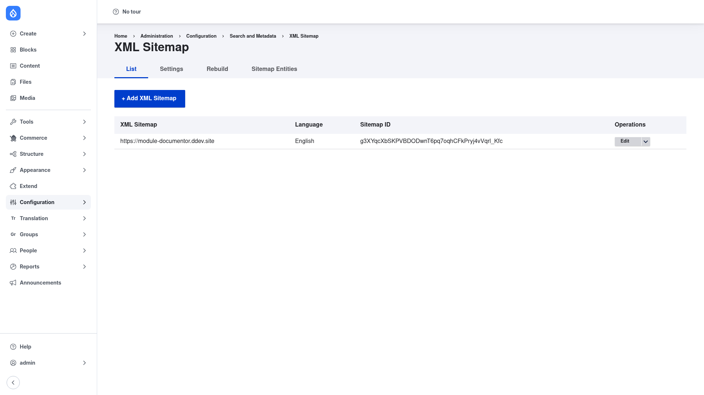

# XML Sitemap — manual setup guide

**XML Sitemap** (`xmlsitemap`) generates a standards-compliant XML sitemap —
served at **`/sitemap.xml`** — that lists your site's URLs so search engines can
crawl and index them efficiently. The file conforms to the
[sitemaps.org](https://www.sitemaps.org/) protocol, and the module can ping search
engines when the sitemap changes (via the companion **XML Sitemap Engines**
submodule). You choose which content is listed **per entity type and per bundle**
— for example "all published Articles, all taxonomy terms in the Tags vocabulary"
— and for each bundle you set a default **priority** (how important a page is,
0.0–1.0) and **change frequency** (how often it changes: daily, weekly, monthly,
…). Editors with the right permission can override those values on individual
items.

The module keeps an internal link table that it indexes incrementally on **cron**,
then generates the sitemap files (splitting large sites into a sitemap index plus
chunk files, and optionally serving them gzip-compressed). If you have used
**Simple XML Sitemap** (`simple_sitemap`), note that both modules solve the same
problem — pick one; this guide covers XML Sitemap. This guide is written for a
**human** clicking through the admin UI. If you want terse, token-cheap references
for an AI coding agent instead, read the sibling [`agent/`](../agent/start.md)
docs.

## Where it lives in the admin menu

Everything in this guide sits under **Configuration → Search and metadata → XML
Sitemap** (`/admin/config/search/xmlsitemap`). That page is organised into tabs:

- **List** (`/admin/config/search/xmlsitemap`) — the sitemaps that exist on the
  site, with rebuild/edit operations.
- **Settings** (`/admin/config/search/xmlsitemap/settings`) — global generation
  options (minimum lifetime, stylesheet, advanced options).
- **Rebuild** (`/admin/config/search/xmlsitemap/rebuild`) — re-collect all links
  and regenerate the sitemap from scratch.
- **Sitemap Entities** — enable sitemap inclusion per entity type and set each
  type's default priority and change frequency.

## Contents

1. [Installation](installation/index.md) — install XML Sitemap with Composer,
   enable it, and choose which companion submodules you need.
2. [Configuration](configuration/index.md) — walk through the Settings tab and the
   overview/rebuild page, then enable entity types and bundles for inclusion with a
   default priority and change frequency.
