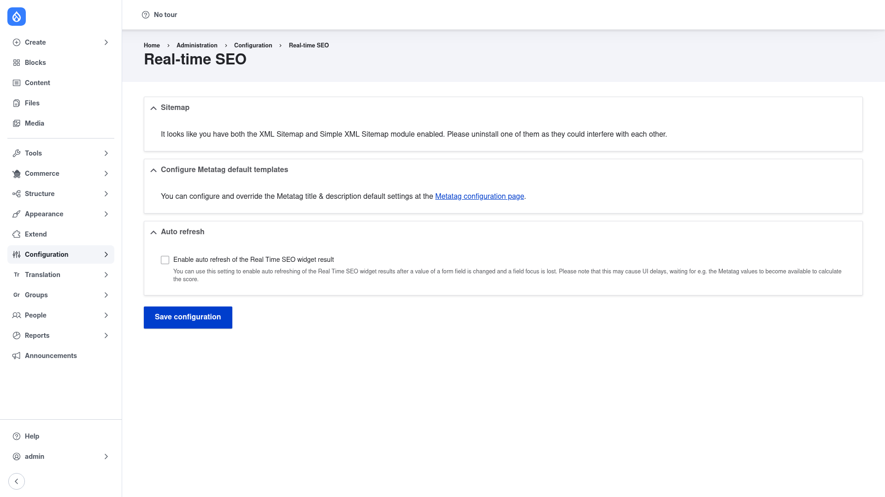

# Real-time SEO (Yoast SEO) — manual setup guide

**Real-time SEO for Drupal** (`yoast_seo`) analyses your content as you write it and
tells you, right on the edit form, how well the page is optimised. Give a page a
**focus keyword** and the module scores how well the content targets it, checks the
length of your meta title and description, and offers readability-style feedback — then
shows a **Google search-result snippet preview** so you can see how the page will look
in search results before you publish. It turns on-page SEO into immediate, visible
feedback, which helps non-experts publish SEO-friendly content without leaving Drupal.

The module builds on the **Metatag** module for the actual meta title and description
output, and on core's **Path** module so the snippet preview can show the real URL
alias. The analysis itself runs in your browser as you type, using the bundled
`rtseo.js` JavaScript library.

This guide is written for a **human** clicking through the admin UI. It walks you, step
by step and with screenshots, from installing the module to configuring the settings
and reading the analysis on a node edit form. If you are looking for terse,
token-cheap references for an AI coding agent, read the sibling
[`agent/`](../agent/start.md) docs instead.

## Where it lives in the admin menu

The module's global settings sit under **Configuration → Search and metadata →
Real-time SEO** (`/admin/config/yoast_seo`). The analysis itself does not have a page
of its own — it appears inline on the **edit form** of any content type (or other
entity) you enable it for.

## Contents

1. [Installation](installation/index.md) — install Real-time SEO with Composer and
   enable it along with its dependencies (Metatag, Token, and core Path/Views).
2. [Configuration](configuration/index.md) — set the site-wide options on the
   settings page, enable the analysis on the content types you want, and read the
   analysis on the node edit form.
